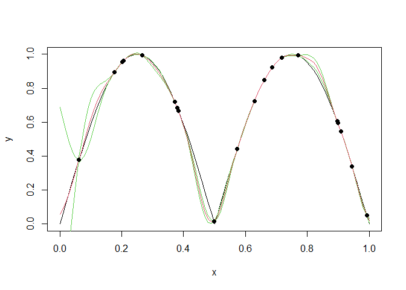
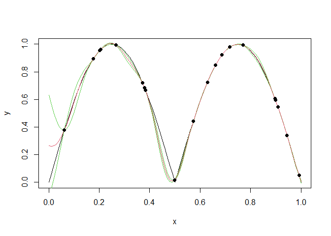

<!-- README.md is generated from README.Rmd. Please edit that file -->
IGP: Interchangeable Gaussian Processes
=======================================

[](https://travis-ci.org/CollinErickson/IGP) [](https://cran.r-project.org/package=IGP) [](https://codecov.io/gh/CollinErickson/IGP)

This is an R package that provides a single interface for many different Gaussian process modeling software options.

This package was formerly called UGP, for Universal Gaussian processes, but universal has a different meaning in kriging so the name was changed for clarity.

Installation
------------

You can install IGP from GitHub with:

    # install.packages("devtools")
    devtools::install_github("CollinErickson/IGP")

Example
-------

The following shows a simple example using the R package `laGP` as the GP code.

``` r
set.seed(0)
library(IGP)
package = "laGP"
n <- 20
d <- 1
f1 <- function(x) {abs(sin(2*pi*x[1]))}
X1 <- matrix(runif(n*d),n,d)
Z1 <- apply(X1,1,f1) + rnorm(n, 0, 1e-3)
gp <- IGP(package=package,X=X1,Z=Z1)

curve(sapply(x, f1), ylab='y')
curve(gp$predict(matrix(x, ncol=1)) - 2 * gp$predict.se(matrix(x, ncol=1)), col=3, add=T)
curve(gp$predict(matrix(x, ncol=1)) + 2 * gp$predict.se(matrix(x, ncol=1)), col=3, add=T)
curve(gp$predict(matrix(x, ncol=1)), col=2, add=T)
points(X1, Z1, pch=19)
```



Below is the exact same thing except using the R package `GauPro`. The predictions made are indistinguishable, meaning that they have fit approximately the same parameter values.

``` r
set.seed(0)
package = "GauPro"
gp <- IGP(package=package,X=X1,Z=Z1)

curve(sapply(x, f1), ylab='y')
curve(gp$predict(matrix(x, ncol=1)) - 2 * gp$predict.se(matrix(x, ncol=1)), col=3, add=T)
curve(gp$predict(matrix(x, ncol=1)) + 2 * gp$predict.se(matrix(x, ncol=1)), col=3, add=T)
curve(gp$predict(matrix(x, ncol=1)), col=2, add=T)
points(X1, Z1, pch=19)
```



Package options
---------------

The available packages and the platform they run on are shown below. The R packages should run easily. The MATLAB packages are called using the `R.matlab` R package and have to open a connection to MATLAB. Thus you need to have MATLAB on your computer, it will be slow, and is likely to have problems. Currently the MATLAB packages are not included in the CRAN version of the package, but they can be found on the GitHub repository. The Python packages are called using the R package `Python.In.R`. It will open a connection to Python and probably will be slow. In addition to requiring that you already have the package (GPy or sklearn) installed, and must be accessible through your default Python path.

| Package            | Platform |
|--------------------|----------|
| DiceKriging        | R        |
| GauPro             | R        |
| GPfit              | R        |
| laGP               | R        |
| mlegp              | R        |
| tgp                | R        |
| DACE (GitHub only) | MATLAB   |
| GPML (GitHub only) | MATLAB   |
| GPy                | Python   |
| sklearn            | Python   |
